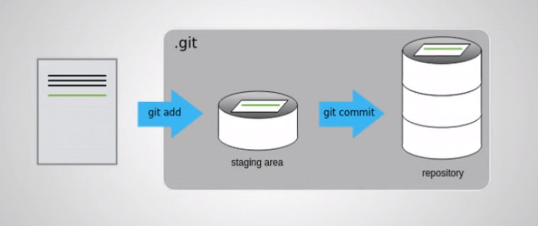

# Comandos Básicos Git

## Chave SSH e documentação Git
 
 [Gerar nova chave ssh](https://help.github.com/en/github/authenticating-to-github/generating-a-new-ssh-key-and-adding-it-to-the-ssh-agent)

 ## Criando o Primeiro Repósitorio

 ```console
 > git init PrimeiroRepo
```

* Será criado o diretorio configurado como repositorio **GIT**.

* Todas as configurações do repositorio ficam na pasta _.git_

* Crie um arquivo, edite e adicione ao repositorio:
 ```console
 > gedit PrimeiroArquivo

 > git add PrimeiroArquivo

 > git commit -m "Criado o primeiro arquivo."
 ```

 # Configurando

 * Configure seu nome e e-mail:
 ```console
 > git config --global user.name "Meu user Name"

 > git config --global user.email "meuemail@email.com"
 ```

 > o comando _--global_ configura localmente o usuario e email para todos os projetos Git criado em sua máquina se não colocar o _--global_ ele cria para apenas o projeto especidico.

 ## Editor View

 * editor padrão do git para editar mensagem commit

 INSERÇÃO :

 SAIR E SALVAR :WQ

 ## Git Status e Log

 * Comando para ver o status do repositório
```console
> git statua
```

* Ver último commits no repositório
```console
> git log
```

## Criar um repositório remoto

* Crie um repositorio no GitHub.

* Configure o repositório remoto.

* Crie um arquivo README.md

* Faça o upload das alterações.

```console
> git remote add origin <url>
```
* Comando para listar os remotes

```console
> git remote -v
```

## Git Add
```console
> git add <lista de arquivos>
```
* Adiciona os arquivos novos e modificados para o próximo commit.
```console
> git add .
```

## Git Commit

```console
> git commit [-m "menssage"]
```
* Registra o commit com todos os arquivos que usou _git add_

* Se o parâmetro de mensagem não for passado abrirá um editor de texto para escrever a mensagem.
```console
> git config --global core.editor gedit
```

## Git Push

* Envia alterações (commits) de uma branch para repositório remoto.

* A primeira vez:

```console
> git push -u origin master
```
* O envio é rejeitado se o repositório não estiver sincronizado.

```console
> git push <remote> <branch>
```
* Sincronizar a branch para repositorio remoto
```console
> git push --set-upstream origin master
```
* No proximo commit poderá utilizar somento o _git push_
```console
> git push
```

## Git Workflow

* Basicamente a maior parte do trabalho com o _git_ consiste nestas tarefas:

  - Editar
  - Commitar
  - Sincronizar com o repositório remoto

* Exercite estes comandos!  

## Status dos Arquivos

* Edite o arquivo criado anteriormenrte.

* Crie um novo arquivo e veja o seu status no repositorio

## Estados dos Arquivos

* Não monitorado (untracked)

    - Quando agente cria algum arquivo

* Modificado (modified)
    - Quando modifica um arquivo que já esteja no repositório.

* Preparado (staged)
    - Quando executamos o comando _git add ._

* Consolidado (commited)
    - Quando executamos o comando _git commit_

    

## Diff
* Exibe diferenças entre commits e branchs
```console
> git diff
```
* Deferença no diretório
```console
> git diff [path]
```
* Mostra o que foi alterado no último commit.
```console
> git diff HEAD~1
```
* Ver diff no GitHub

# Git Clone
* Baixa o repositório remoto.
* Outra forma de criar um repositório local.

* Já vem com o remoto configurado.
```console
> git clone <URL>
```

# Git Pull

* Baixa as alterações do repositorio remoto.

* Mantém o repositorio sincronizados com os últimos commits de uma branch.
```console
> git pull
```

## Navegar no Histórico

* Permite ver como um arquivo ou todo o repositorio estava em um determinado commit.
```console
> git checkout <commit> <file>
```

## Git Checkout
* Altera o repositório para o estado daquele commit.

* Útil para fazer testes antes e depois de alterações.
```console
> git checkout <commit>
```

* Para voltar o repositório no último commit.
```console
> git checkout master
```

## Desfazendo Alterações

* Irá desfazer todas as alterações que não estejam no Stage desde o último commit.
```console
> git checkout -- <path_or_file>
```

* Desfazer as alterações desde o último commit incluíndo o Stage.
```console
> git checkout HEAD  -- <path_file>
```

* Descartar as mudanças do arquivo
```console
> git checkout -- <name_of_file>
```

* Descarta todas as modificações de todos asquivos modificados.
```console
> git checkout -- .
```

* Descarta as modificações mesmo depois do _git add_
```console
> git checkout HEAD  -- <name_ile>
```

## Git Revert

* Irá criar um novo commit que desfaz as alterações do commit especificado.

* Útil para desfazer um commit antigo
```console
> git revert <commit>
```

## Git Reset

* Resetar o repositório para um determinado commit.
```console
> git reset <commit>
```

* Resetar e remover todas as alterações.
  - Cuidado ao usar! Não usar se já estiver publicado.

* Útil para desfazer últimos commits.  
```console
> git reset --hard <commit>

> git reset HEAD~1 // remove o ultimo commit, mas fica em stats os arquivos modificados permanecem

> git reset HEAD~1 --hard // remove o ultimo commit, e as modificações.
```

## Conflitos

* Conflitos podem acontecer ao unirmos altaerações.

* Acontecem quando versões diferentes possuem as mesmas linhas nos mesmos arqivos editados diferentes.

* O Git identifica os conflitos e fica aguardando a solução deles.

* Ao remover os conflitos deve ser feito um commit.

# Branching
* Criando ramificações no repositório

## Branch

* É uma lista de commits.

* Representa ramificações do repositório.

* Muito útil para trabalhos colaborativos.

* Branchs de desencolvimento facilitam o controle.

* Branch master é a padrão.

```console
> git branch
```

* Cria uma nova branch
```console
> git branch <nova_branch>
```

* Exclui uma branch
```console
> git branch -d <branch>
```

## Git Checkout Branch

* Muda para branch
```console
> git checkout <branch>
```
* Seu repositório passa a ter os commits que a branch possui e novo commits serão adicionados à ela.

## Git Merge
```console
> git merge <branch>
```
 * Aplicar os commits de uma branch na branch atual.

* Encontra um commit comum(base) entre as branchs e aplica todos os commits que a branch atual não pussui.

* Caso existam commits na branch atual que não estão na outra, será criado um commit de merge.

# Git Rebase
```console
> git rebase <branch>
```
* Semelhante ao **Merge** porém é diferente na ordem de apliar os commits.

* No **Rebase**, os seus commits na frente da base são removidos temporariamente, os commits de uma outra branch são aplicados na sua branch e por fim seus commits são aplicados um a um.

* Pode acontecer conflitos que serão resolvidos para cada commit.

## Git Fetch
```console
> git fetch
```
* Baixa as atualizações do remote porém não aplica elas no repositório.

* Permite fazer o rebase de uma branch em vez de fazer o merge.

*  **Pull = Fetch _ Merge**

* Fetch é melhor para manter histórico do desenvolvimento.

### Exercicio

* Com branch master sicronizadas você e seu par devem fazer commits na master.

* Seu par eve fazer o push dos commits dele.

* Antes de você fazer o push dos seus commits deve fazer o rebase com os commits do seu par.

## Tag

* Útil para definir versões estáveis do projeto.

* Semelhante a branch porém não recebe mais commits.

* Guarda um estado do repositório.

```console
> git tag [nome da tag]

> git push <remote> <tag>